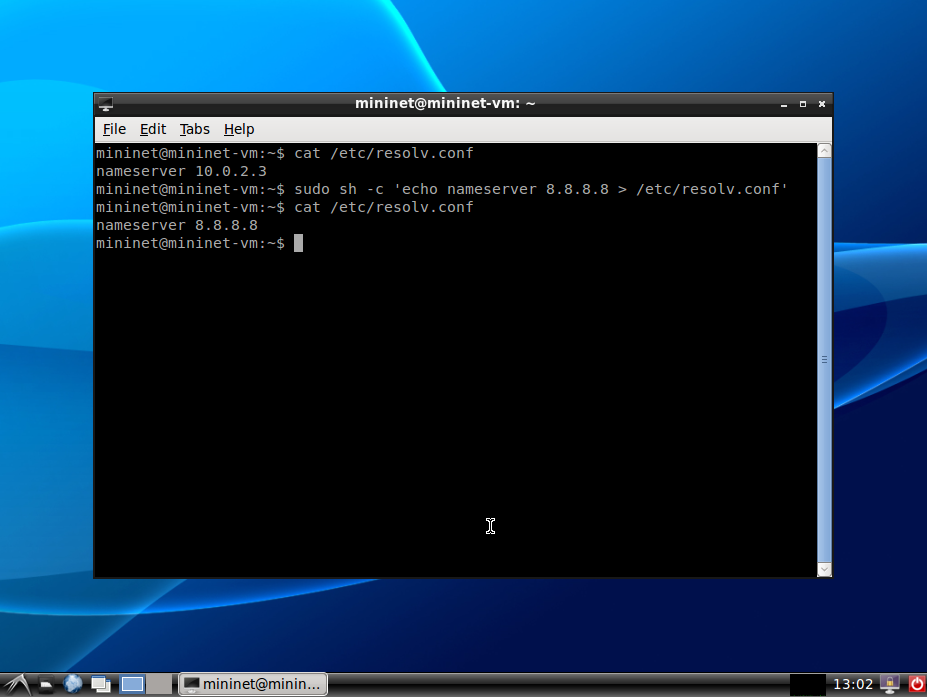
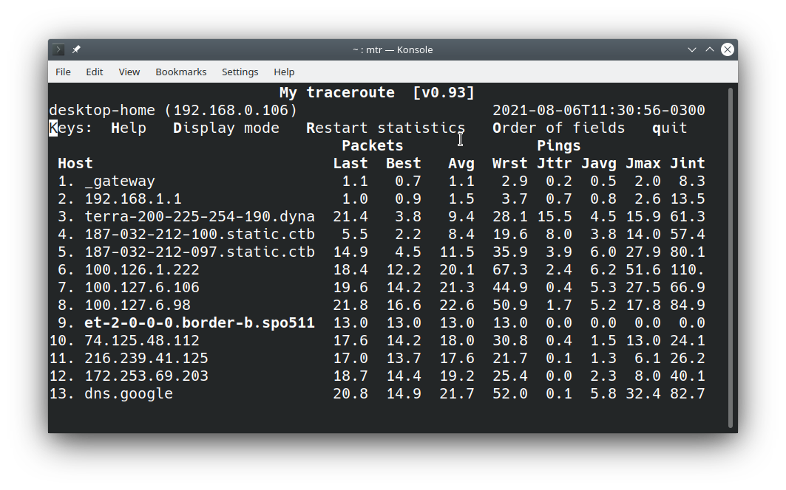

# Laboratório 3.1: Streaming de Multimidia e Efeito de Atrasos e Erros

## Identificação

* Aluno: "coloque aqui o seu nome"

## Objetivos

+ Identificar o efeito prático do aumento do **atraso**, **erros** no funcionamento de uma aplicação de streaming armazenada.
+ Identificar como aplicações de streaming utilizam adaptações de qualidade de transmissão durante uma transmissão.

## Formato das respostas

Exceto quando informando explicitamente, todos os resultados devem ser formatados usando a formatação de código no Markdown, conforme já feito nos laboratórios anteriores. Respostas em texto livre devem ser escritas em **texto normal**, sem formatação.

* Documentação do formato de tabelas no Markdown Github: <https://docs.github.com/en/github/writing-on-github/working-with-advanced-formatting/organizing-information-with-tables>

**Observe** que neste laboratório você deverá incluir arquivos externos com os dados coletados no experimento, além dos gráficos gerados. 

## Requisitos mínimos de entrega deste relatório

Conforme indicado no plano da disciplina, para obter nota mínima de 6,0 do relatório será necessário que ele atenda a **todos** os requisitos abaixo indicados:

1. Todas as tarefas na seção "Resultados" devem ser respondidas e devem seguir o formato solicitado.
2. Não deve haver qualquer tipo de cópia deste relatório com o que outro aluno. Os experimentos e o relatório são individuais.
3. O seu relatório deverá ser submetido pelo Github Classroom.

A complementação da nota pela avaliação qualitativa do relatório, considerará as respostas das questões abertas (em texto livre) e **sobretudo** os resultado do experimento.

Na seção [**"Feedback"**](#Feedback) ao fim deste relatório, o professor incluirá a avaliação do seu relatório.

## Recursos

Além do Mininet, você utilizará um protótipo de cliente (player) de video do DASH-HTTP, em Javascript, e que executa dentro de navegadores web, como Chrome e Firefox. 

+ Protótipo de Player DASH-HTTP para demonstração e depuração: <http://players.akamai.com/players/dashjs>
+ Exemplos de videos de diversas categorias e qualidade para testar no cliente <https://reference.dashif.org/dash.js/latest/samples/index.html>.

<a name="cuidados" />

## Cuidados Adicionais

Esta seção deve **necessariamente** ser lida antes de realizar o experimento e, dependendo do caso, o experimento terá que ser refeito para atender aos detalhes aqui mencionados. 

Ao realizar os experimentos: 

1. Desabilite o cache HTTP do seu browser para realizar o experimento. **Obrigatório**.

   Como o DASH-HTTP utiliza requisições HTTP para recuperar porções do video, ele acaba explorando o cache HTTP para melhorar o desempenho da reprodução do video: depois que um video é reproduzido pela primeira vez, a reprodução subsequente ocorre com parcelas do video mantidas localmente pelo browser (no cache). Neste caso, mudar os atrasos ou taxas de transmissão **não terá efeito** na reprodução do video. 

   Consequentemente, você terá que desabilitar o cache HTTP do browser utilizado durante o experimento.

   Para fazê-lo no Firefox (ou Chrome), escolha no menu **Ferramentas** / **Desenvolvedor Web** / **Rede** (ou simplesmente **Ctrl-Shift-E**) e selecione a caixa **"Desabilitar Cache"** (veja figura).

   Há outras maneiras de fazê-lo. **Não é suficiente recarregar a página** (usando F5, por exemplo).

2. 🚩 (acréscimo em 10/agosto) A versão da VM Linux onde usualmente o Mininet é distribuído, não vem com os codecs necessários para o navegavor web exibir o conteúdo multimidia da página DASH-HTTP utilizada no laboratório. Nessa situação, o navegador carregará a página do player DASH, tentará carregar o video, mas ele nunca aparecerá. Ao abrir o **Web Console** do browser, para visualizar os erros Javascript, aparecerá o problema. Para resolvê-lo, você pode instalar o VLC pois nas suas dependências estarão incluidos os pacotes com codes necessários. Instale o VLC utilizando o comando abaixo. Depois disso, o navegador passará a exibir o video (talvez seja necessário reiniciá-lo).

        sudo apt-get install vlc-nox
        
3. 🚩 (acréscimo em 11/agosto) O Firefox não permite que você o execute como root (que é o que ocorrerá em `h1`), sem uma configuração adicional. Para executar o Firefox utilize o comando abaixo dentro de uma estação como `h1` (sugestão do Matheus Rondon):

        sudo -u mininet firefox
   
<a id="mininet-config" />

## Configuração do Ambiente Mininet

Duas preocupações adicionais você precisará para configurar a execução do ambiente Mininet:

* **Acesso à Internet em estação virtualizada mininet**: 

   Você precisará tomar duas precauções para que uma estação com rede virtualizada acesse a Internet e você consiga realizar o seu experimento:

   1. Neste experimento você terá que acessar um recurso na Internet em um navegador web executando uma estação com rede virtualizada pelo mininet (`h1` ou `h2`, para ficar mais evidente). No mininet, por padrão, as estações **não acessam** a Internet e para fazê-lo você precisará habilitar o NAT no mininet, o que você faz invocando o mininet com a opção `--nat`. Se você realizar corretamente essa configuração, um ping para a estação `8.8.8.8` (ou outro IP Internet) deverá funcionar.
   
   2. 🚩 (acréscimo em 11/agosto) A maneira como a VM do Mininet está configurada, uma estação Mininet não conseguirá utilizar o DNS e portanto não conseguirá acessar sites na Internet. Para fazê-lo, precisaremos modificar a configuração do serviço de DNS usado pelo Linux da VM mininet. 
   
            sudo sh -c 'echo nameserver 8.8.8.8 > /etc/resolv.conf'
            
   Ao executar esse comando, o arquivo `/etc/resolv.conf` deverá ficar com o conteúdo `nameserver 8.8.8.8`. Você confirma isso  com o seguinte comando:
   
        cat /etc/resolv.conf
    
   Entre então na estação `h1` do Mininet e execute o comando `nslookup www.ufg.br` que deverá aparecer o IP da estação `www.ufg.br`. Do contrário, reveja os passos anteriores. O IP `8.8.8.8` é um servidor de DNS público da Google. Esses passos estão ilustrados na figura abaixo. **IMPORTANTE**: ao reiniciar a VM, a configuração do DNS voltará à original, então você terá que repetir os passos acima.
   
   
   
* **Configuração de Jitter no Mininet**

   Para configurar um jitter em cenário virtualizado no mininet você precisará adicionar um novo parâmetro `jitter`, dado em `ms`, que corresponde à variação do atraso que também precisará ser indicado no parâmetro de configuração do cenário. Por exemplo, para simular largura de banda de 54Mbps, atraso de 50ms e jitter de 20ms, assim como habilitar o NAT mencionado no item anterior, você precisará executar o mininet da seguinte maneira:
   
        sudo mn --nat --link tc,bw=54M,delay=50ms,jitter=20ms
        
## MTR

O MTR é uma ferramenta similar ao traceroute, mas com muito mais flexibilidade e poder na coleta dos dados de comunicação. Basicamente, você precisa indicar o endereço do destino como parâmetro e ele mostrará a rota estimada para o destino e diversas medições de atraso em cada roteador no caminho. Neste experimento, só nos interessará os dados coletados no destino. Utilizaremos o MTR para estimar o jitter, passando o parâmetro `-o` e os campos que queremos que sejam exibidos, como no seguinte exemplo (que você pode usar no experimento, alterando o endereço): 

        mtr -o NBAWJMXI 8.8.8.8 -n

A figura abaixo mostra o exemplo de saída do MTR para o comando indicado. No caso mecionado, solicitamos ao MTR para exibir na sequência as medições de **último**, **melhor**, **médio** e **pior** atrasos, seguido de **último**, **médio** e **pior** jitter, terminando com jitter **interchegada** de pacotes. Atrasos são sempre o RTT e em ms.

<a id="atualizacao-mtr" />

🚩 (acréscimo em 12/agosto) A versão do `mtr` disponível em algumas VMs do mininet causam alguns problemas na execução. Para você conseguir fazer os testes, baixe uma versão mais nova do `mtr`. Deixei uma versão para vocês instalarem usando os seguintes comandos:

        cd ~
        wget rcarocha.github.io/rc2/software/mtr-0.89.zip
        unzip mtr-0.89.zip

É importante não esquecer da primeira linha, pois ela copiará os arquivos para o diretório raiz do usuário mininet. Feito isso, quando for executar, faça o seguinte:

        ~/mtr -o NBAWJMXI 8.8.8.8 -n
        
Observe com atenção o uso do **`~/mtr`** (til-barra-mtr) e, sugiro, usar a opção `-n` no final. Você deverá executar como admin, mas isso não será problema dentro do mininet. Caso apareça o erros

        Failure to open IPv4 sockets: Operation not permitted
        Failure to open IPv6 sockets: Address family not supported by protocol
        /home/mininet/mtr: Failure to start mtr-packet: Invalid argument
        
Execute como admin

        sudo ~/mtr -o NBAWJMXI 8.8.8.8 -n

## Funcionamento de Players DASH

Experimente o uso do cliente de streaming de midia DASH-HTTP que utilizaremos neste laboratório.

1. No navegador, abra o protótipo de player DASH disponibilizado pela Akamai em: <http://players.akamai.com/players/dashjs> (**não** utilize o player `hls.js`). Deixei uma demonstração de uso desse player para o laboratório em <https://youtu.be/s0-_a0bD6cI>.
2. Escolha duas ou mais midias do seguinte tipo:

   + Um video sob demanda (VOD), que corresponde a **uma aplicação de multimidia armazenada**. Procure fazer testes também com o video em 4K (requer 4 Kbps de bitrate)
   + Um video ao vivo (LIVE), que corresponde a **uma aplicação de multimidia ao vivo**.

   
## Parte I: Definição do Cenário de Testes

Nesta primeira parte, você configurará o ambiente para a realização dos testes.

1. Meça os atrasos e jitter da sua estação para a a fonte dos videos. Não é necessário fazê-lo dentro do Mininet. **Importante**: a fonte dos videos não é o endereço do player, mas o endereço indicado no arquivo MPD que descreve a mídia. É importante que este teste seja feito imediatamente antes das demais tarefas do laboratório, pois o atraso pode variar ao longo do dia. Coloque os dados coletados em tabela, seguindo modelo da tabela abaixo. Faça testes durante, ao menos, 1 minuto, para coletar os atrasos (**D**) e jitter (**J**). Meça também a bitrate obtida para essa midia, carregando no player DASH e verificando o melhor valor de bitrate que você obtem em "Basic Statistics"

| N | Tipo de Midia | Midia | Estação | IP      | Bitrate | Dmin | Dmédio | Dmax | Jmédio | Jinter | 
|---|---------------|-------|---------|---------|---------|------|--------|------|--------|--------| 
| 1 | Ao vivo       | url   | a.b.com | 1.2.3.4 | 1Mbps   | ? ms | ? ms   | ? ms | ? ms   | ? ms   | 
| 2 | armazenada    | url   | a.b.com | 1.2.3.4 | 0.5Mpbs | ? ms | ? ms   | ? ms | ? ms   | ? ms   |  | 

2. Determinar o jitter, atraso que serão utilizados no experimento. Escolha 10 valores de atraso, desde o valor mínimo do atraso obtido nas medições até 200 ms. Para cada um desses valores, escolha três valors de jitter: 0, 100% do atraso e 200% o valor do atraso. Coloque os valores escolhidos na tabela abaixo, conforme o modelo.

| Atraso (ms) | Jitter 1 | Jitter 2 | Jitter 3 |
|-------------|----------|----------|----------|
| 20 ms       | 0 ms     | 20 ms    | 40 ms    |

3. Determine taxas de transmissão (BW) que você utilizará para fazer o experimento, que devem variar em 10%, 30%, 50%, 70%, 100%, 200% e 1000% (10x) o valor do bitrate conseguido na tabela do item I.1.

| N | Tipo de Midia | Bw1    | Bw2    | Bw3    | Bw4    | Bw5    | Bw6    | Bw7    |
|---|---------------|--------|--------|--------|--------|--------|--------|--------|
| 1 | Ao vivo       | ? kbps | ? kbps | ? Mbps | ? Mbps | ? Mbps | ? Mbps | ? Mbps |
| 2 | armazenada    | ? kbps | ? kbps | ? Mbps | ? Mbps | ? Mbps | ? Mbps | ? Mbps |

## Parte II: Experimentação do Efeito do Atraso em Streaming

Nestes experimento você deverá desabilitar o cache do browser, conforme indicado na seção <a href="#cuidados">Cuidados</a>. Se você não fizer isso, coletará resultados errados e seu experimento será perdido.

Para cada uma das midias escolhidas anteriormente, siga os procedimentos abaixo. Todas as respostas deverão está dispostas na seção *"Resultados Coletados"*.

1. Baixe a descrição da midia pela URL com terminação MPD que aparece no topo da aplicação. 
2. Verifique a lista dos bitrates oferecidos em cada tipo de segmento. O arquivo MPD é um XML e os bitrates estão indicados na propriedade `bandwidth` da tag `Representation`. Informe o bitrates em Kbps ou Mbps.
3. Para cada um dos valores de atraso e jitter previstos anteriormente, configure um ambiente mininet para reproduzir o cenário desejado. Inicialmente, a largura de banda será ignorada. Meça os atrasos com `ping` dentro da estação para saber se o mininet está reproduzindo exatamente aquele atraso que deseja (faça os ajustes necessários).
   
   1. Execute o player em um navegador disparado de dentro do uma estação com rede virtualizada (`h1` ou `h2`, para ficar mais evidente).
   2. Observando as estatística do player, colete os valores de **Bitrate** (selecionado) e o **Tamanho do Buffer**. Esses valores irão variar bastante no inicio, por isso, espere um tempo até que eles fique razoavelmente estáveis. Caso não fiquem estáveis, indique os dois ou três valores de bitrate/atraso. 
   3. Coloque os valores coletados em uma tabela seguindo o modelo abaixo. Lembre-se que as duas primeiras colunas surgem das escolhas da parte I deste laboratório e as duas últimas serão coletadas.
      
4. Comente os resultados obtidos e eventuais instabilidades nos valores. Explique os resultados obtidos ou comente surpresas encontradas no comportamento.
5. Para cada um dos valores de largura de banda escolhidos anteriormente, e com atrasos/jitter em 0, refaça o experimento anterior, coletando o novamente o Bitrate e tamanho do buffer selecionados. 
6. Comente os resultados obtidos e eventuais instabilidades nos valores. Explique os resultados obtidos ou comente surpresas encontradas no comportamento.
   
### Resultados Coletados

**Midia 1: Streaming (*indique o tipo*)**

1. Bitrates oferecidos para a mídia (texto livre)

   (resposta)
   
2. Tabela com variações de bitrates e buffer em função do atraso e jitter.
  
      | Atraso | Jitter | Bitrate | Buffer (s) |
      |--------|--------|---------|------------|
      |        |        |         |            |
      
3. Coloque os comandos mininet utilizados para configurar cada uma das situações anteriores.       
4. Comente os resultados obtidos e eventuais instabilidades nos valores. Explique os resultados obtidos ou comente surpresas encontradas no comportamento. (texto livre)

   (resposta)

5. Tabela de bitrates e buffer em função da variação da largura de banda.

      | Largura de Banda | Bitrate | Buffer (s) |
      |------------------|---------|------------|
      |                  |         |            |

6. Comente os resultados obtidos e eventuais instabilidades nos valores. Explique os resultados obtidos ou comente surpresas encontradas no comportamento. (texto livre)

   (resposta)

**Midia 2: Streaming (*indique o tipo*)**

1. Bitrates oferecidos para a mídia (texto livre)

   (resposta)
   
2. Tabela com variações de bitrates e buffer em função do atraso e jitter.
  
      | Atraso | Jitter | Bitrate | Buffer (s) |
      |--------|--------|---------|------------|
      |        |        |         |            |
      
3. Coloque os comandos mininet utilizados para configurar cada uma das situações anteriores.       
4. Comente os resultados obtidos e eventuais instabilidades nos valores. Explique os resultados obtidos ou comente surpresas encontradas no comportamento. (texto livre)

   (resposta)

5. Tabela de bitrates e buffer em função da variação da largura de banda.

      | Largura de Banda | Bitrate | Buffer (s) |
      |------------------|---------|------------|
      |                  |         |            |

6. Comente os resultados obtidos e eventuais instabilidades nos valores. Explique os resultados obtidos ou comente surpresas encontradas no comportamento. (texto livre)

   (resposta)
   
   
## Referências

+ Iraj Sodagar, ["The MPEG-DASH Standard for Multimedia Streaming Over the Internet,"](http://ieeexplore.ieee.org/xpls/icp.jsp?arnumber=6077864) IEEE Multimedia, vol. 18, no. 4, pp. 62-67, October-December, 2011 
+ Stoekhammer, T. ["Dynamic adaptive streaming over HTTP-design principles and standards."](https://www.w3.org/2010/11/web-and-tv/papers/webtv2_submission_64.pdf) Proceedings of the Second Annual ACM Conference on Multimedia Systems. Vol. 2014. New York, USA: ACM, 2011.
+ <https://en.wikipedia.org/wiki/Dynamic_Adaptive_Streaming_over_HTTP>
+ Ibrahim Ayad, Youngbin Im, Eric Keller, Sangtae Ha, [**A Practical Evaluation of Rate Adaptation Algorithms in HTTP-based Adaptive Streaming**](https://www.sciencedirect.com/science/article/pii/S1389128618300288), Computer Networks, Volume 133, 14 March 2018, Pages 90-103, ISSN 1389-1286, <https://doi.org/10.1016/j.comnet.2018.01.019>.

## Feedback do Professor

*Esta seção será escrita pelo professor ao final da avaliação do seu relatório*.

